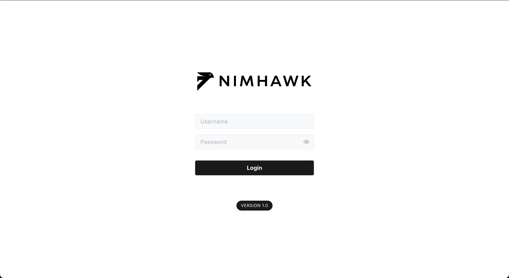
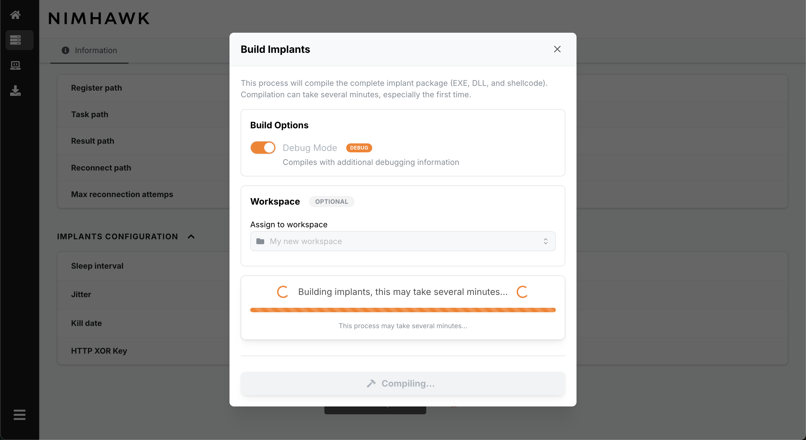
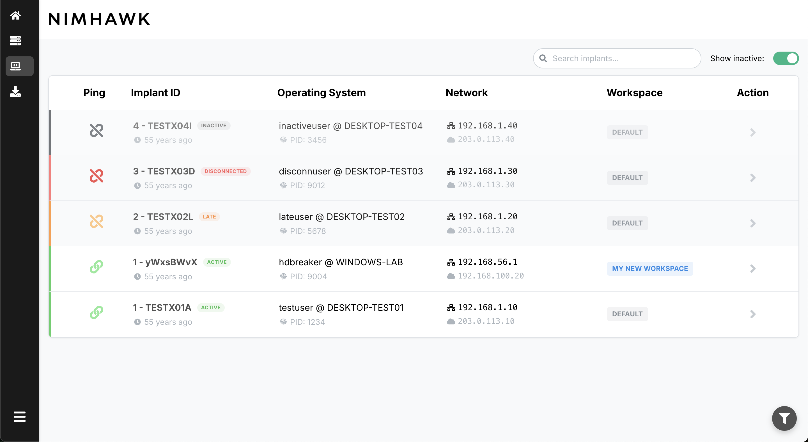
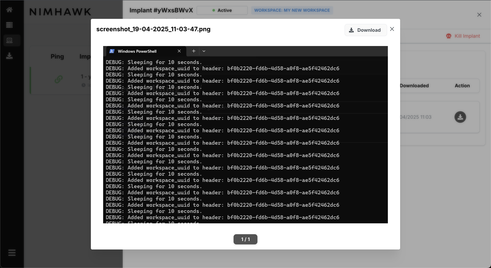
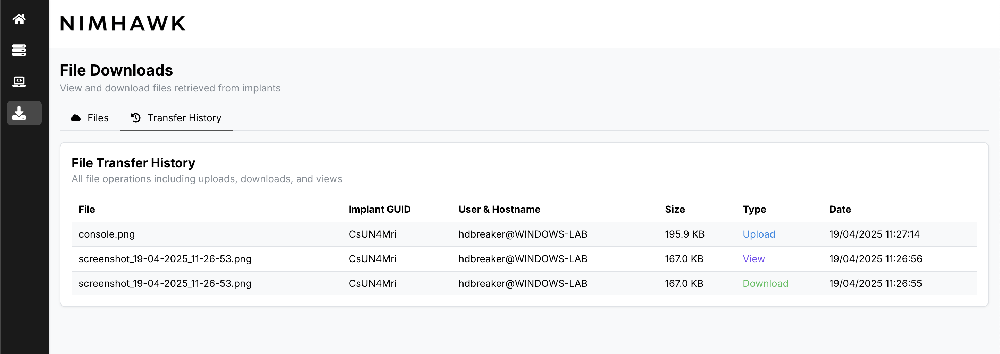
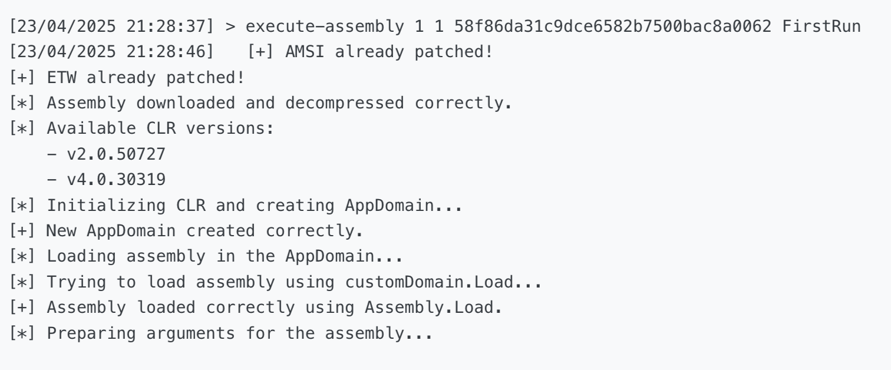
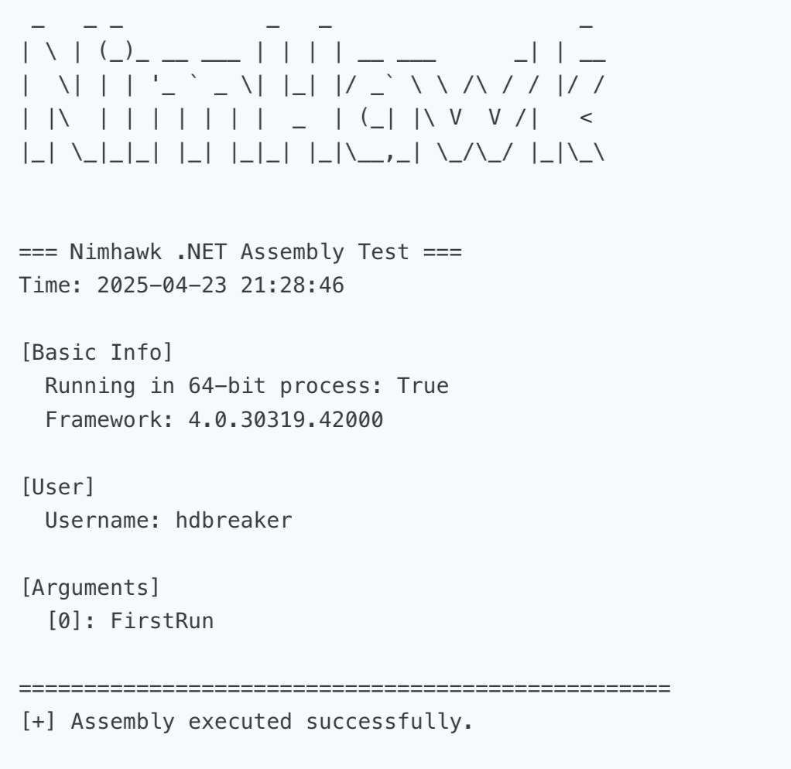
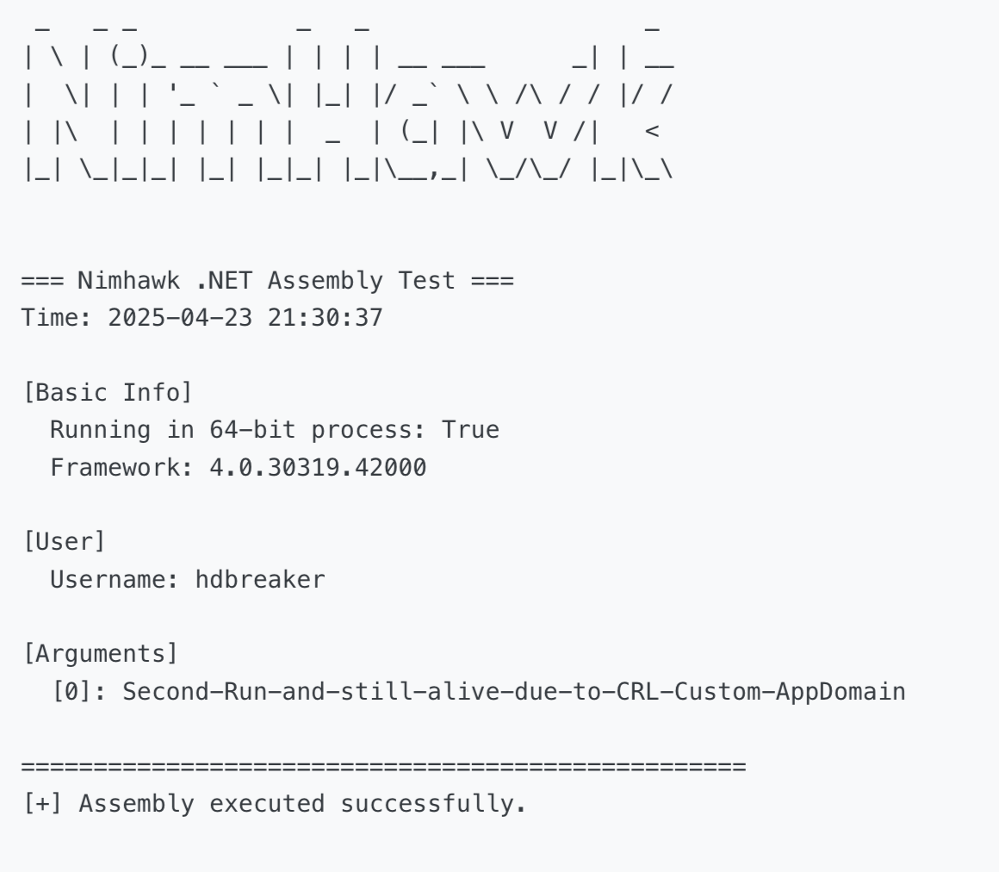
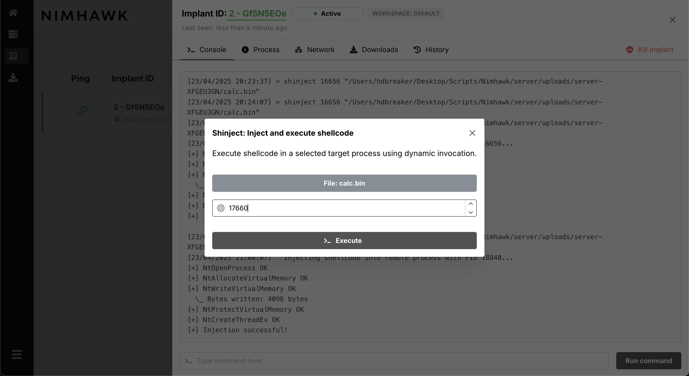
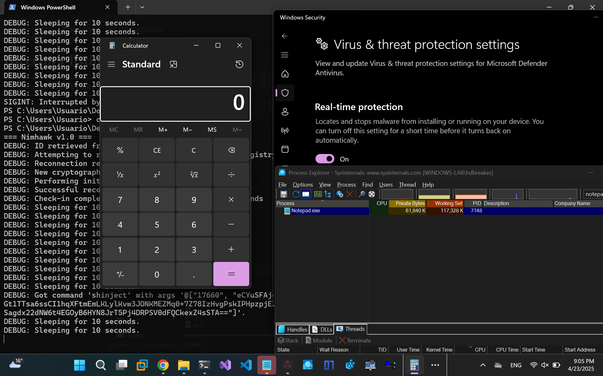

<div align="center">
  

  <h1>Nimhawk - a powerful, modular, lightweight and efficient command & control framework.</h1>

[](DEVELOPERS.md#contributing)
[](https://github.com/hdbreaker/nimhawk)
[](LICENSE)
[](https://github.com/hdbreaker/nimhawk/releases)
[](https://buymeacoffee.com/hdbreaker9s)
</div>

> 🚧 **Development status**: Nimhawk is currently in active development. Core functionality is working, but some features are still experimental. The implant only supports Windows x64 platforms. Contributions and feedback are highly welcomed!

> 🤝 **Code contribution**: I'm looking forward to developers building a Linux agent for Nimhawk. The developer's documentation, especially the section 'How to develop your own Implant or extend Implant functionality,' should be enough for the task.

> 🤝 **Community**: Hey! If you're into Malware Dev, Hacking, Exploit writing or just a tech nerd like me - hit me up! Always looking for new hacker friends to collaborate, share ideas and maybe grab a beer. No fancy resumes needed.

## Table of Contents

### 1. Getting Started
- [Introduction](#introduction)
- [Key Features](#key-features)
- [Quick Start Guide](#quick-start-guide)
- [Basic Usage](#basic-usage)

### 2. Setup and Configuration
- [System Requirements](#system-requirements)
- [Compatibility](#compatibility)
- [Development Environment Setup](#development-environment-setup)
- [Configuration](#configuration)

### 3. Technical Documentation
- [Architecture](#architecture)
- [Authentication System](#authentication-system)
- [Available Commands](#available-commands)
- [File Exchange System](#file-exchange-system)

### 4. Deployment Options
- [Docker Support](#docker-support)
- [Redirector Setup](#redirector-setup)
- [Frontend Configuration](#frontend-configuration)

### 5. Development and Contributing
- [Development](#development)
- [Future Development](#future-development)
- [Research and Inspiration](#research-and-inspiration)

### 6. Reference
- [FAQ](#faq)
- [Troubleshooting](#troubleshooting)
- [Notes and Considerations](#notes-and-considerations)
- [Disclaimer](#disclaimer)

## Quick Start Guide

> 💡 **Pro Tip**: Before diving in, make sure to review the [System Requirements](#system-requirements) section.

### 1. Dependencies Installation

#### Installing Nim and Nimble
```bash
# On Linux/macOS using choosenim
# In Silicon Mac you will need to compile nim. Chill google about it, it's easy!
curl https://nim-lang.org/choosenim/init.sh -sSf | sh

```

### Initial Setup
```bash
# Clone the repository
git clone https://github.com/hdbreaker/nimhawk
cd nimhawk

# Configure your environment
cp config.toml.example config.toml
```

#### Installing Nimble Modules
```bash
# Navigate to implant directory
cd implant/

# Install required dependencies
nimble install
```

#### Installing Python Dependencies
```bash
# Navigate to server directory
cd server/

# Create and activate virtual environment
python3 -m venv venv

# On Linux/macOS
source venv/bin/activate
# On Windows
.\venv\Scripts\activate

# Install dependencies
pip install -r requirements.txt
```

#### Installing Frontend Dependencies
```bash
# Navigate to web interface directory
cd server/admin_web_ui/

# Install Node.js dependencies
npm install

# Run Frontend
npm run dev
```

### 3. Start the Server
```bash
python3 nimhawk.py server
```

### 4. Access the Web Interface
- Open your browser and navigate to `http://localhost:3000`
- Default credentials:
  - Email: `admin@nimhawk.com`
  - Password: `P4ssw0rd123$`

> ⚠️ **Security Note**: Change default credentials immediately in production environments.

## Introduction

Nimhawk is an advanced command and control (C2) framework that builds upon the exceptional foundation laid by [Cas van Cooten](https://github.com/chvancooten) ([@chvancooten](https://twitter.com/chvancooten)) with his [NimPlant](https://github.com/chvancooten/NimPlant) project. Cas's innovative work in developing a lightweight implant written in Nim has been groundbreaking for this project.

This project would not exist without Cas's technical expertise, dedication to open source, and commitment to knowledge sharing. Nimhawk expands on NimPlant's original functionality with:

- A more modular architecture for easier contributions and extensions
- Enhancements to implant security and evasion capabilities
- A completely renovated graphical interface with modern authentication
- Improved data handling and command processing systems
- Comprehensive documentation focused on practical deployment and usage
- Enhanced multi-user support with role-based access control
- Advanced workspace management for better operational organization
- Real-time implant status monitoring with visual indicators
- Improved file transfer system with preview capabilities
- Robust error handling and reconnection mechanisms
- Integrated build system with web-based compilation
- Flexible deployment options including Docker support

We are profoundly grateful to Cas van Cooten for his generosity in open-sourcing NimPlant, his ongoing contributions to the security community, and his pioneering work in leveraging the Nim language for security tools. We also extend our thanks to all NimPlant contributors who have helped shape the codebase that serves as our foundation.

## Key Features

> 🎯 **Core Capabilities**: Nimhawk combines powerful features with operational security.

### Operational Features
- ✨ **Modular Architecture**: Designed for easy expansion
- 🛡️ **Enhanced Implant**: Reduced detection signatures
- 🌐 **Advanced Web Interface**: Intuitive dashboard
- 🔧 **Web Compilation**: Generate implants from dashboard

### Security Features
- 🔐 **Improved Security**: Dual authentication system
- 📊 **Optimized Storage**: Efficient data handling
- 🔍 **Enhanced Debugging**: Improved error tracking
- 📡 **Multi-Status Support**: Real-time implant monitoring

## Recent improvements

* **Enhanced check-in system**: Implemented optimized tracking for implant check-ins, separating them from command history for cleaner console output
* **Refined data transfer calculation**: More accurate measurement of data transferred between server and implants
* **UI improvements**: Enhanced implant details display with real-time metrics and more intuitive layout
* **Improved reconnection system**: Enhanced implant reconnection mechanism that properly handles Registry cleanup, removing previous implant ID before registering a new one to prevent orphaned entries
* **Inactive implant management**: Added ability to safely delete inactive implants from the database, maintaining a clean operational environment
* **Comprehensive Web UI**: Full-featured web interface for real-time monitoring and control of implants

## Nimhawk's Screenshots 

### Secure authentication
[](docs/images/login.png)
*The secure authentication system features a minimalist design with email/password authentication and session management for multiple operators.*

### Command & control interface
[](docs/images/dashboard.png)
*Nimhawk's modern dashboard featuring a clean design with the project logo and framework description. The intuitive UI provides quick access to all operational functions.*

### Comprehensive server information
[](docs/images/server.png)
*Server information panel with detailed metrics showing connection status, API endpoints, communication paths, and configuration details. The collapsible sections provide easy access to technical information.*

### Implant builder with real-time feedback
[](docs/images/builder_workspace.png)
*The implant builder interface allows operators to select target workspaces when generating new implants, supporting operational segmentation.*

[](docs/images/builder_process.png)
*Real-time compilation feedback shows the build process step-by-step, providing transparency and debugging information during implant generation.*

[](docs/images/builder_sucess.png)
*Upon successful compilation, operators receive a summary of generated files with direct download capability for deployment.*

### Multi-status visual management
[](docs/images/multi-status.png)
*Nimhawk's advanced status tracking system uses color-coding and icons to represent different implant states: Active (green), Late (orange), Disconnected (red), and Inactive (gray). This enhances situational awareness during operations.*

### Advanced search and filtering
[](docs/images/implant-search-bar.png)
*The intuitive search system allows operators to quickly locate specific implants by hostname, username, IP address, or other attributes with real-time filtering.*

[](docs/images/implant-filter.png)
*Advanced filtering capabilities enable operators to focus on specific implant states, improving management efficiency when handling large numbers of connections.*

### Interactive command console
[](docs/images/console.png)
*The interactive console provides command history, syntax highlighting, and adjustable display options. The streamlined interface shows only relevant command history with clear input/output separation.*

### Detailed implant information
[](docs/images/implant-info-process.png)
*Process information tab displaying detailed system data including process name, PID, username, and operating system version.*

[](docs/images/implant-info-network.png)
*Network tab showing comprehensive connectivity details including internal/external IP addresses and communication settings.*

[](docs/images/implant-info-download-dashboard.png)
*The downloads dashboard lists all files retrieved from the target system with metadata and download options.*

[](docs/images/implant-info-download-preview.png)
*Built-in file preview functionality allows operators to examine downloaded content directly in the browser with support for multiple file formats.*

[](docs/images/implant-console-upload.png)
*The file upload modal provides a streamlined interface for transferring files to the target system with optional destination path specification.*

[](docs/images/implant-info-history.png)
*Comprehensive activity log tracking all interactions with timestamps, command counts, and data transfer statistics.*

### File management system
[](docs/images/download.png)
*Global downloads view showing all retrieved files across all implants with sorting and filtering capabilities.*

[](docs/images/global-file-history.png)
*Complete file transfer history tracking all uploads and downloads across all operations with detailed metadata and timestamps.*

## System Requirements

### Server Requirements
| Component | Requirement | Notes |
|-----------|-------------|--------|
| Python | 3.8+ | Required for backend |
| RAM | 2GB+ | Minimum recommended |
| Disk | 1GB+ | For database and logs |
| OS | Any modern OS | Linux recommended |

### Implant (Nim)
- **Target Platform**: Windows x64 only (Windows 7 SP1, Windows 8.1, Windows 10, Windows 11, Server 2012 R2+)
- Nim toolchain (installation recommended through `choosenim`)
- Required Nimble packages (automatically installed during build)
- On Linux/MacOS: `mingw-w64` toolchain for cross-compilation

## Compatibility

### Server component
| OS | Support Status | Notes |
|----|---------------|-------|
| Ubuntu 20.04+ | ✅ Fully Supported | Recommended for production |
| Debian 11+ | ✅ Fully Supported | Tested and working |
| Kali Linux | ✅ Fully Supported | Optimized for pentesting workflows |
| macOS 11+ | ✅ Fully Supported | Both Intel and Apple Silicon |
| Windows 10+ | ⚠️ Limited Support | May require additional configuration |

### Implant component
| OS | Architecture | Support Status | Notes |
|----|-------------|----------------|-------|
| Windows 7 SP1 | x64 | ✅ Working | Legacy OS support |
| Windows 8.1 | x64 | ✅ Working | Limited testing |
| Windows 10 | x64 | ✅ Fully Supported | Primary development target |
| Windows 11 | x64 | ✅ Fully Supported | Regularly tested |
| Windows Server 2012 R2+ | x64 | ✅ Working | Limited testing |
| macOS | Any | ❌ Not Supported | Planned for future releases |
| Linux | Any | ❌ Not Supported | Planned for future releases |
| Windows | x86/32-bit | ❌ Not Supported | No plans to support |

## Compiler compatibility
| Compiler | Host OS | Target | Status |
|----------|---------|--------|--------|
| Nim + MinGW | Linux | Windows x64 | ✅ Fully Supported |
| Nim + MinGW | macOS | Windows x64 | ✅ Fully Supported |
| Nim | Windows | Windows x64 | ✅ Fully Supported |

Note: The implant is currently developed and tested exclusively for 64-bit Windows environments. Support for other platforms is on the roadmap but not currently available.

### Cross-compiling with nim.cfg

For building Windows payloads from Linux or macOS, Nimhawk uses cross-compilation configured through `nim.cfg`:

1. **Install MinGW toolchain**:
   ```bash
   # On macOS
   brew install mingw-w64
   
   # On Linux (Debian/Ubuntu)
   apt-get install mingw-w64
   ```

2. **nim.cfg configuration**:
   The nim.cfg file contains platform-specific settings for cross-compilation. Key components include:
   ```
   # Set target OS to Windows
   os = windows
   
   # 32-bit Windows compilation settings
   i386.windows.gcc.path = "/path/to/mingw/bin"
   i386.windows.gcc.exe = "i686-w64-mingw32-gcc"
   i386.windows.gcc.linkerexe = "i686-w64-mingw32-gcc"
   
   # 64-bit Windows compilation settings
   amd64.windows.gcc.path = "/path/to/mingw/bin"
   amd64.windows.gcc.exe = "x86_64-w64-mingw32-gcc"
   amd64.windows.gcc.linkerexe = "x86_64-w64-mingw32-gcc"
   
   # Assembly and linker options
   --passC:"-masm=intel"
   --passL:"-Wl,--image-base" 
   --passL:"-Wl,0x400000"
   ```

3. **Troubleshooting cross-compilation**:
   - If you encounter errors, verify the paths to your MinGW toolchain
   - On macOS, you may need to update paths in nim.cfg based on your Homebrew installation
   - Use `which x86_64-w64-mingw32-gcc` to locate the correct path to MinGW toolchain binaries

The cross-compilation setup allows you to develop and build Windows implants from non-Windows systems, which is particularly useful for red team operations conducted from Linux or macOS environments.

## New structure and improvements

Nimhawk introduces important structural changes compared to NimPlant:

1. **Directory reorganization**:
   - Clear separation between server (`server`) and web interface (`admin_web_ui`)
   - Modules organized by functionality
   - Scalable structure to facilitate development

2. **Agent improvements**:
   - Reconnection system with exponential backoff
   - Secure encryption key transfer
   - Mutex to prevent multiple executions
   - Enhanced registry management with proper cleanup during reconnection
   - Robust error handling for network disconnection scenarios

3. **Modern web interface**:
   - Login authentication
   - Responsive and improved design
   - Web panel for implant compilation
   - Real-time visualization of information and results
   - Enhanced implant details with relevant metrics

4. **Advanced security**:
   - Dual authentication system:
     - Web UI/API authentication with user accounts and session management
     - Implant-server authentication using custom HTTP headers (`X-Correlation-ID`) and communication keys
   - Encryption of all communications
   - Compression for large data transfers (files, screenshots, assemblies)
   - Validation mechanisms to prevent unauthorized connections

5. **Database optimizations**:
   - Improved schema for check-in tracking
   - More efficient data storage and retrieval
   - Better separation of command history and system events

## Configuration

Before using Nimhawk, you must configure the `config.toml` file. It is recommended to copy the `config.toml.example` file as a starting point.

| Category | Configuration      | Description                                                                              |
|-----------|-------------------|------------------------------------------------------------------------------------------|
| admin_api    | ip                | IP where the Admin API server will listen (Web UI API included)                        |
| admin_api    | port              | Port for the Admin API server                                                          |
| implants_server  | type              | Listener type: HTTP or HTTPS                                                        |
| implants_server  | sslCertPath       | Path to SSL certificate (required for HTTPS)                                        |
| implants_server  | sslKeyPath        | Path to SSL key (required for HTTPS)                                                |
| implants_server  | hostname          | Optional hostname for implant connections                                           |
| implants_server  | port              | Listener port for implant connections                                               |
| implants_server  | registerPath      | URI path for initial implant registration                                           |
| implants_server  | taskPath          | URI path for implant task retrieval                                                 |
| implants_server  | resultPath        | URI path for implant result posting                                                 |
| implants_server  | reconnectPath     | URI path for implant reconnection                                                  |
| implant   | listenerIp        | Public IP address for implants to connect back to                                      |
| implant   | riskyMode         | Compile with advanced but potentially detectable commands                                |
| implant   | sleepMask         | Use sleep masking techniques (only for exe, not DLL or shellcode)                       |
| implant   | sleepTime         | Default sleep time in seconds between check-ins                                          |
| implant   | sleepJitter       | Jitter percentage to randomize sleep times                                               |
| implant   | killDate          | Date when implants will self-terminate (format: yyyy-MM-dd)                              |
| implant   | userAgent         | Custom User-Agent string used by implants for HTTP requests                              |
| implant   | httpAllowCommunicationKey | Secret token for machine-to-machine authentication between implant and server    |
| auth      | enabled           | Enable authentication for web interface and API                                          |
| auth      | session_duration  | Session duration in hours for authenticated users                                        |
| auth.users| email             | User email for login authentication                                                      |
| auth.users| password          | User password for login authentication                                                   |
| auth.users| admin             | Whether user has admin privileges (true/false)                                           |

### Authentication system

Nimhawk includes a complete authentication system with the following features:

- **Web UI authentication**: Username/password login for access to the admin interface
- **Session management**: Configurable session duration with automatic expiration
- **Multi-user support**: Configure multiple users with different permission levels
- **API authentication**: Session-based authentication for all API endpoints
- **Implant authentication**: Separate machine-to-machine authentication for implants using `httpAllowCommunicationKey`

By default, a user account is created with the credentials:
- Email: `admin@nimhawk.com`
- Password: `P4ssw0rd123$`

It is strongly recommended to change these default credentials in your production environment.

## Quick start guide

### Implant compilation

The web panel facilitates the generation of implants with different configurations:

1. Access the "Server" section in the web interface
2. Use the "Compile Implants" button to open the panel
3. Configure options as needed (debug/release)
4. Click "Build" to generate the implant

Alternatively, you can use the `nimhawk.py` script:

```bash
python3 nimhawk.py compile [exe|dll|raw|all] nim-debug
```

### Starting the server

To start the Nimhawk server:

```bash
python3 nimhawk.py server

or

cd server/
python3 main.py Nimhawk
```

This will start both the Implant API server and the Admin API server on the configured ports.

## Development roadmap

<div align="center">

| Feature | Description | Status | Priority |
|---------|-------------|:------:|:--------:|
| **Core Features** | | | |
| Modular Architecture | Architecture separated by modules for easier contribution | `DONE` | High |
| Web Interface | Modern React-based UI with authentication | `DONE` | High |
| Implant Compilation | Web-based compilation with various output formats | `DONE` | High |
| Multi-status Implants | Visual tracking with different status indicators | `DONE` | High |
| File Exchange System | Secure bidirectional file transfers with preview | `DONE` | High |
| **Evasion Techniques** | | | |
| Sleep Masking (Ekko) | Implemented by @chvancooten for stealthier operations | `DONE` | High |
| NTDLL Unhooking | Bypass EDR hooks on NTDLL functions | `WIP` | High |
| AMSI/ETW Bypass | Disable or circumvent security monitoring | `WIP` | High |
| Memory Encryption | Protection of implant in memory while dormant | `Waiting for Development` | Medium |
| Anti-Sandbox | Techniques to detect and avoid analysis environments | `Waiting for Development` | Low |
| **Payload Delivery** | | | |
| DLL Injection | Basic DLL injection capabilities | `Waiting for Development` | Medium |
| Shellcode Injection | VirtualAlloc + CreateRemoteThread techniques | `Waiting for Development` | Medium |
| Process Hollowing | Advanced process replacement techniques | `Waiting for Development` | Medium |
| APC Injection | Asynchronous Procedure Call injection methods | `Waiting for Development` | Low |
| **Platform Support** | | | |
| Windows x64 Support | Windows 7+ x64 architecture support | `DONE` | High |
| Linux Implant | Linux-compatible version of implant | `Waiting for Development` | Medium |
| macOS Implant | macOS-compatible version of implant | `Waiting for Development` | Medium |
| **Infrastructure** | | | |
| HTTP/HTTPS Comms | Basic HTTP/HTTPS communication | `DONE` | High |
| DNS Tunneling | Data exfiltration over DNS | `Waiting for Development` | Low |
| Domain Fronting | Proxy communications through trusted domains | `Waiting for Development` | Low |
| **Tooling & Analysis** | | | |
| Stealthiness Analysis | YARA rule generation and signature detection | `Waiting for Development` | Medium |
| PE-Sieve Integration | In-memory analysis of implant | `Waiting for Development` | Low |
| ThreatCheck Functionality | Pinpoint specific detection triggers | `Waiting for Development` | Medium |
| **Usability** | | | |
| Advanced Workspace UI | Dedicated UI section for workspace management | `Waiting for Development` | Low |
| Advanced Persistence | Built-in persistence mechanisms | `Waiting for Development` | Medium |
| Implant Update Mechanism | Update implants without redeployment | `Waiting for Development` | Medium |

</div>

- **Advanced Evasion Techniques**:
   - NTDLL Unhook
   - AMSI and ETW patching/bypassing mechanisms (I need to improve this)   
   - Sleep obfuscation techniques - Ekko is on place by @chvancooten
   - Memory payload protection (encryption at rest)

- **Stealthiness Analysis Tools**:
   - The `detection` folder currently contains Nimplant detection rules, not Nimhawk-specific ones.
   - Future development will transform this directory into a comprehensive toolkit with:
     - PE-sieve integration for in-memory analysis
     - ThreatCheck-style functionality for pinpointing detection signatures
     - Automated YARA rule generation and testing
   - These tools will make it easier to analyze and improve the stealthiness of implants

- **Payload Delivery Mechanisms**:
   - In the future we will include different loaders in the building process for the following techniques:
       - Classic DLL Injection
       - Remote Shellcode Injection
         - VirtualAllocEx, WriteProcessMemory, CreateRemoteThread
         - NtCreateThreadEx for more stealth operations
         - Section mapping techniques
       - Process Hollowing with advanced unmapping techniques
       - Thread Hijacking with context manipulation
       - APC Injection (standard and early bird variants)
       - Early Bird Injection with queue exploitation
       - Local NTDLL Unhooking with PE header parsing
       - Remote NTDLL Unhooking for cross-process hook removal
       - Waiting Thread Hijacking with suspending mechanisms
       - Module Stomping and PE section manipulation
       - COM Hijacking techniques

- **Defense Evasion**:
   - Anti-sandbox detection techniques
   - Anti-analysis countermeasures
   - Stack spoofing for hiding call stacks

## Research and inspiration

Nimhawk draws inspiration from various offensive security projects and research:

- Cobalt Strike's Beacon architecture for C2 communications
- Outflank's excellent research on in-memory execution
- MDSec's creative approaches to defense evasion
- Sektor7's comprehensive training materials
- Process Injection research by The DFIR Report, Elastic, and Huntress
- Modern offensive tooling like Sliver, Havoc, and Brute Ratel

The project aims to incorporate best practices from these sources while contributing new techniques and approaches to the field.

## Notes and considerations

- Nimhawk implants use custom headers for authentication:
  - `X-Request-ID`: Carries the implant's UUID
  - `Content-MD5`: Carries task ID for job executions
  - `X-Correlation-ID`: Carries the HTTP communication key
  - `X-Robots-Tag`: Carries the Workspace UUID for workspace association

- Nimhawk is an actively developing project; it is recommended to review the technical documentation for implementations in sensitive environments.

## Development

For detailed information about the project structure, development setup, and contribution guidelines, please refer to our [DEVELOPERS.md](DEVELOPERS.md) guide.

We welcome contributions from the community! Before starting, please review our development documentation to ensure a smooth collaboration process.

Please note: Nimhawk is currently under active development. While we strive for stability, you may encounter issues. We encourage you to report (and fix) any bugs by creating a Pull Request and joining our development community.

## Acknowledgments

Special thanks to [Cas van Cooten](https://github.com/chvancooten) for creating NimPlant, the project that served as the fundamental basis for Nimhawk. And to all the contributors who have contributed to the development of both projects. You can find him on Twitter [@chvancooten](https://twitter.com/chvancooten).

We would also like to express our gratitude to:

- [MalDev Academy](https://maldevacademy.com/) for their exceptional educational resources on malware development techniques that have been instrumental in improving our implant capabilities and evasion methods.

- [VX-Underground](https://vx-underground.org/) for maintaining the largest collection of malware source code, samples, and research papers, which have been invaluable for understanding advanced techniques and state-of-the-art implementations.

Their work has been foundational to many of the concepts and techniques implemented in this project.

## Community quote
 
What impresses me most about Nimhawk is how it balances:

**Usability**: The intuitive interface and workspace system make it accessible even for larger teams.

**Technical capabilities**: The advanced features like secure file exchange and integrated preview demonstrate attention to detail. 

**Documentation**: The level of documentation for both users and developers is exceptional, something rare in open-source projects in this space.
 
In summary, Nimhawk represents a significant advancement in open-source C2 tools, combining advanced features with a modern user experience. Its focus on modularity and extensibility positions it as a solid foundation for future innovations in this field.

## Disclaimer

Nimhawk is designed for and intended to be used by:
- Information Security Professionals
- Red Team Operators
- Security Researchers
- Defensive Security Specialists
- Maldev Students

The primary purpose of this framework is to facilitate technical research into malware development and operations, enabling the improvement of defensive strategies and detection mechanisms.

### Legal notice

This tool should only be used in strictly controlled environments with proper authorization. The authors and contributors of Nimhawk assume no liability and are not responsible for any misuse or damage caused by this program. Users are responsible for ensuring compliance with local, state, and federal laws and regulations.

By using Nimhawk, you agree that:
1. You will only use it for legal purposes
2. You have proper authorization for testing
3. You will not use it for unauthorized access or exploitation
4. You understand the risks and consequences of misuse

## Compatibility

Nimhawk only works on Windows x64.

## FAQ

### General questions

#### What is Nimhawk?
Nimhawk is a Command & Control (C2) framework designed for red team operations, featuring a Python backend server and implants written in the Nim programming language.

#### How is Nimhawk different from other C2 frameworks?
It does not really do. I created it primarily to improve my own malware development skills and share the learning journey with others. If you're interested in understanding how C2s work or want to learn Nim for security development, this project's documentation and code will be helpful. And hey, if you're into malware development for research or defense, feel free to learn from my mistakes!

#### Is Nimhawk free to use?
Yes, Nimhawk is open-source and free to use under the terms specified in the license. However, it's designed for legitimate security testing with proper authorization.

### Technical questions

#### What platforms does the implant support?
Currently, Nimhawk implants only work on Windows x64 environments (Windows 7 SP1 and newer). There are no plans to support 32-bit Windows, though macOS and Linux support may be added in the future.

#### Can I compile implants on my Mac/Linux machine?
Yes, you can cross-compile Windows implants from Linux or macOS using the MinGW toolchain. The `nim.cfg` file contains the necessary configuration for cross-compilation.

#### Does Nimhawk support HTTPS communications?
Yes, Nimhawk supports both HTTP and HTTPS communications. For HTTPS, you'll need to configure SSL certificates in the `config.toml` file.

#### How do I customize the C2 communication paths?
You can customize all communication paths (register, task, result, reconnect) in the `config.toml` file under the `[implants_server]` section.

#### How does the authentication system work?
Nimhawk has a dual authentication system:
1. Web UI authentication using username/password for operators
2. Implant-server authentication using a pre-shared key (httpAllowCommunicationKey) and custom HTTP headers

### Operational questions

#### How do I create and deploy an implant?
1. Configure your `config.toml` file
2. Use the web interface "Compile Implants" button or run `python3 nimhawk.py compile [exe|dll|raw|all] nim-debug` 
3. Deploy the generated implant on your target system

#### What are the implant's persistence capabilities?
Currently, persistence must be manually implemented using standard Windows persistence techniques (Registry, Scheduled Tasks, Services). The implant itself does not have built-in persistence mechanisms.

#### How can I contribute to Nimhawk?
Contributions are welcome! Check DEVELOPERS.md file for guidelines on contributing to the project.

## Architecture

```
┌────────────────────────────────────────┐              ┌───────────────────┐
│                                        │              │                   │
│  OPERATOR MACHINE                      │              │  TARGET MACHINE   │
│                                        │              │                   │
│  ┌───────────┐                         │              │  ┌───────────┐    │
│  │ Web UI    │                         │              │  │  Nimhawk  │    │
│  │ (React)   │                         │              │  │  Implant  │    │
│  └───────────┘                         │              │  └─────┬─────┘    │
│      │                                 │              │        │          │
│      │  HTTPS REST API                 │              │        │          │
│      │                                 │              │        │          │
│      │                                 │              │        │          │
│  ┌───│─ ──────────────────────┐        │              │        │          │
│  │   │  PYTHON BACKEND        │        │              │        │          │
│  │  ┌▼─────────────────┐      │        │              │        │          │
│  │  │ Admin API Server │      │        │              │        │          │
│  │  └──────────────────┘      │        │              │        │          │
│  │                            │        │              │        │          │
│  │  ┌──────────────────┐      │        │              │        │          │
│  │  │ Implants Server  │◄─────┼────────┼──────────────┼────────┘          │
│  │  └──────────────────┘      │        │              │   HTTP/HTTPS      │
│  └───────────┬────────────────┘        │              │                   │
│              │                         │              │                   │
│              ▼                         │              │                   │
│  ┌───────────────────┐                 │              │                   │
│  │    nimhawk.db     │                 │              │                   │
│  │    (SQLite)       │                 │              │                   │
│  └───────────────────┘                 │              │                   │
│                                        │              │                   │
└────────────────────────────────────────┘              └───────────────────┘
```

Nimhawk uses a basic client-server architecture - nothing groundbreaking, but it gets the job done:

1. **Implant (The Agent)**:
   - Written in Nim because I wanted to improve my maldev skills in this language
   - Some evasion tricks I learned along the way
   - Easy to extend if you want to add your own commands (it would be amazing if you join the Nimhawk Army!)
   - Uses XOR encryption (yeah, I know, but it works - Make it work, later you can make it better!)

2. **Backend (The Server Stuff)**:
   - **Admin API**:
     - Regular REST API with some basic auth
     - Nothing fancy, just the basics that work
   
   - **Implant Server**:
     - Handles the implants' check-ins and tasks
     - Simple queue system for commands
     - Basic status tracking
     - Auto-reconnect when things break
     - basic http auth through machine to machine tokens

3. **Web UI (The Pretty Part)**:
   - React because... well, it's React
   - Real-time updates (when they work)
   - Web-based implant builder

4. **Database**:
   - Just SQLite - keeping it simple
   - Stores implant info and commands
   - Some basic file handling

5. **Security Stuff**
   - Custom headers for implants
   - Some anti-debug tricks
   - Basic encryption
   - Nothing revolutionary, but secure enough for learning

6. **Dev Features**
   - Logs everything (maybe too much)
   - Good documentation
   - Code that works or must do!

### Persistence (Optional)

Establishing persistence for longer engagements:

```bash
# Registry persistence
shell reg add "HKCU\Software\Microsoft\Windows\CurrentVersion\Run" /v "WindowsUpdate" /t REG_SZ /d "C:\Users\user\Documents\update.exe" /f

# Scheduled task
shell schtasks /create /sc minute /mo 30 /tn "WindowsUpdate" /tr "C:\Users\user\Documents\update.exe" /f
```

Probably you will need to add a loader at the moment, if you know what is a Loader well done!
But if you don't, I recommend checking out [Maldev Academy](https://maldevacademy.com/) and [Sektor7](https://institute.sektor7.net/).

## Available Commands (inherited and extended from NimPlant)

The Nimhawk implant supports the following commands:

### System Information
- `whoami` - Display current user information
- `hostname` - Display system hostname
- `ps` - List running processes
- `env` - Show environment variables
- `getav` - Get information about installed antivirus products
- `getdom` - Get domain information

### File System Operations
- `ls [directory]` - List directory contents
- `cd [directory]` - Change current directory
- `pwd` - Print working directory
- `cat [file]` - Display file contents
- `rm [file]` - Remove file
- `mkdir [directory]` - Create directory
- `cp [source] [destination]` - Copy file
- `mv [source] [destination]` - Move or rename file

### Network Operations
- `curl [url]` - Make HTTP request
- `download [file]` - Download file from target
- `upload [file] - Upload file to target
- `wget [url] [destination]` - Download file from URL to target

### Execution Commands
- `run [command]` - Execute command and capture output

### Risky Commands (Available in Risky Mode)
- `execute-assembly [file]` - Execute .NET assembly in memory
- `inline-execute [file]` - Execute raw shellcode in memory
- `powershell [command]` - Execute PowerShell command
- `shell [command]` - Execute shell command (cmd.exe)
- `shinject [pid] [file]` - Inject shellcode into process

### Control Commands
- `sleep [seconds] [jitter]` - Set sleep time and jitter
- `checkin` - Force check-in with server 
- `kill` - Terminate implant

For detailed usage of each command, use the `help` command.

# Docker Support

Nimhawk provides official Docker support for easy deployment and consistent environment across different systems.

## Building the Docker Image

Build the Nimhawk Docker image with:

```bash
docker build -t nimhawk .
```

## Running Nimhawk in Docker

The container supports multiple operation modes:

```bash
docker run -it -p 3000:3000 -p 9669:9669 -p 80:80 -p 443:443 \
  -v nimhawk-data:/nimhawk/server \
  nimhawk full
```

### Available Commands

```
server    - Start the Nimhawk server through nimhawk.py (generates .xorkey file)
compile   - Compile implants (e.g., docker run nimhawk compile exe nim-debug)
frontend  - Start only the frontend dev server
full      - Start both backend and frontend servers
shell     - Start an interactive shell
help      - Show this help message
```

### Port Mapping

The exposed ports must match those configured in your `config.toml` file:
- `3000`: Frontend React application
- `9669`: Admin API server (as configured in `admin_api.port`)
- `80`: Default HTTP listener for implants (as configured in `implants_server.port`)
- `443`: HTTPS listener (only needed if using HTTPS in `implants_server.type`)

### Important Notes

- The `-it` flags are **required** for proper console interaction with the Nimhawk server, as it relies on interactive terminal input.
- Using the `server` command will generate a new XOR key file for encryption.
- The `full` command is recommended for most users as it starts both backend and frontend.

### Examples

```bash
# Start full Nimhawk (backend + frontend)
docker run -it -p 3000:3000 -p 9669:9669 -p 80:80 -p 443:443 nimhawk full

# Compile implants only
docker run -it nimhawk compile all

# Compile implants in debug mode
docker run -it nimhawk compile all nim-debug

# Launch an interactive shell in the container
docker run -it nimhawk bash
```

### Persistent Storage

For persistent data storage, mount a volume to preserve the database:

```bash
docker run -it -p 3000:3000 -p 9669:9669 -p 80:80 -p 443:443 \
  -v nimhawk-data:/nimhawk/server \
  nimhawk full
```

This ensures your implant data, command history, and files remain available between container restarts.

# Frontend Configuration for Client - Server Execution

Nimhawk supports deployment configurations where frontend and backend run on different servers. This is configured through the `.env` file in the `server/admin_web_ui` directory.

## The `.env` File

```
SERVER_IP=https://nimhawk-backend.example.com
SERVER_PORT=9669
IMPLANT_SERVER_IP=https://implant-listener.example.com
IMPLANT_SERVER_PORT=443
```

### Configuration Options

- `SERVER_IP`: URL of the Admin API server (backend)
- `SERVER_PORT`: Port of the Admin API server (must match `admin_api.port` in `config.toml`)
- `IMPLANT_SERVER_IP`: URL of the implant listener (typically same as SERVER_IP)
- `IMPLANT_SERVER_PORT`: Port for implant communications (must match `implants_server.port` in `config.toml`)

### Docker Deployment

For Docker deployments, you can use the default configuration as the container handles proper routing between components. No changes to the `.env` file are necessary unless you're exposing the services on different ports.

### Distributed Deployment

When running the frontend and backend on separate servers or cloud services:

1. Create or modify the `.env` file in the `server/admin_web_ui` directory
2. Configure `SERVER_IP` to point to your backend server (e.g., `https://nimhawk-backend.example.com`)
3. Ensure `SERVER_PORT` matches your backend's exposed port
4. Update `IMPLANT_SERVER_IP` and `IMPLANT_SERVER_PORT` to direct implants to the correct implants listener (in general, it will be the same SERVER_IP but in other port.)

### Example for Distributed Setup

```
SERVER_IP=https://nimhawk-backend.example.com
SERVER_PORT=9669
IMPLANT_SERVER_IP=https://nimhawk-backend.example.com
IMPLANT_SERVER_PORT=443
```

This configuration allows you to host the UI on a separate service from the backend, which can be useful for scaling, security segregation, or cloud-based deployments.


# Redirector Setup

In this section, we will explain how to configure multiple redirectors theoretically. This system has not been tested in production yet, but it should work according to traffic redirection principles. Redirectors act as intermediaries between the implant and the C2 server, helping to protect the actual server infrastructure.

## Basic Redirector Setup

The simplest way to set up a redirector is using socat:

```bash
# Install socat
apt-get install socat

# Basic HTTP redirector
# Listens on port 80 and redirects all traffic to C2 server at 192.168.1.100:80
socat TCP4-LISTEN:80,fork TCP4:192.168.1.100:80

# HTTPS redirector (requires SSL certificate)
# Listens on port 443 and redirects to C2 server at 192.168.1.100:443
socat OPENSSL-LISTEN:443,fork,reuseaddr,cert=server.pem,verify=0 TCP4:192.168.1.100:443
```

## Advanced Redirector Configuration

For more sophisticated setups, you can use socat with additional options:

```bash
# Redirector with logging
# Listens on 192.168.1.200:80, redirects to 192.168.1.100:80 and saves logs
socat TCP4-LISTEN:80,fork,reuseaddr TCP4:192.168.1.100:80 | tee -a /var/log/redirector.log

# Redirector with header modification
# Listens on 192.168.1.200:80 and modifies Host header before redirecting
socat TCP4-LISTEN:80,fork,reuseaddr \
  SYSTEM:'while read line; do \
    if [[ $line =~ ^Host: ]]; then \
      echo "Host: 192.168.1.100"; \
    else \
      echo "$line"; \
    fi; \
  done' \
  TCP4:192.168.1.100:80
```

## Cloudflare worker redirector

For a more resilient and distributed setup, you can use Cloudflare Workers:

```javascript
// Cloudflare Worker code for redirector
addEventListener('fetch', event => {
  event.respondWith(handleRequest(event.request))
})

async function handleRequest(request) {
  // Modify headers as needed if you need it.
  const headers = new Headers(request.headers)
  headers.set('X-Forwarded-For', '192.168.1.100')
  
  // Forward request to C2 server
  const response = await fetch('https://192.168.1.100', {
    method: request.method,
    headers: headers,
    body: request.body
  })
  
  return response
}
```

## Redirector Chain

For additional security, you can chain multiple redirectors:

```
Implant -> Redirector1 (192.168.1.100) -> Redirector2 (192.168.1.150) -> C2 Server (192.168.1.200)
```

```bash
# First redirector (192.168.1.100)
# Listens on port 80 and redirects to second redirector
socat TCP4-LISTEN:80,fork,reuseaddr TCP4:192.168.1.150:80

# Second redirector (192.168.1.150)
# Listens on port 80 and redirects to final C2 server
socat TCP4-LISTEN:80,fork,reuseaddr TCP4:192.168.1.200:80
```

## Security Considerations

When using multi chain redirectors:

1. **IP Whitelisting**: Configure firewall rules to create a secure chain:
   ```bash
   # On Redirector1 (192.168.1.100) - Accepts all connections, this server will be the one used in Implant `callBackIP` in config.toml
   iptables -A INPUT -p tcp --dport 80 -j ACCEPT   # Allow all incoming HTTP traffic
   iptables -A INPUT -p tcp --dport 443 -j ACCEPT  # Allow all incoming HTTPS traffic

   # On Redirector2 (192.168.1.150) - Only accepts from Redirector1
   iptables -A INPUT -p tcp -s 192.168.1.100 --dport 80 -j ACCEPT   # Allow HTTP from Redirector1
   iptables -A INPUT -p tcp -s 192.168.1.100 --dport 443 -j ACCEPT  # Allow HTTPS from Redirector1
   iptables -A INPUT -p tcp --dport 80 -j DROP   # Block all other HTTP traffic
   iptables -A INPUT -p tcp --dport 443 -j DROP  # Block all other HTTPS traffic

   # On C2 Server (192.168.1.200) - Only accepts from Redirector2
   iptables -A INPUT -p tcp -s 192.168.1.150 --dport 80 -j ACCEPT   # Allow HTTP from Redirector2
   iptables -A INPUT -p tcp -s 192.168.1.150 --dport 443 -j ACCEPT  # Allow HTTPS from Redirector2
   iptables -A INPUT -p tcp --dport 80 -j DROP   # Block all other HTTP traffic
   iptables -A INPUT -p tcp --dport 443 -j DROP  # Block all other HTTPS traffic
   ```

2. **Logging**: Enable logging to monitor traffic patterns
   ```bash
   # Monitor active connections
   watch -n 1 "netstat -an | grep :80"
   
   # View logs in real-time
   tail -f /var/log/redirector.log
   ```

3. **SSL/TLS**: Use HTTPS redirectors with proper certificates
   ```bash
   # Generate SSL certificate on Operator machine
   openssl req -x509 -newkey rsa:4096 -keyout key.pem -out cert.pem -days 365 -nodes
   
   # Start HTTPS redirector on Redirector1 (exposed to agents)
   socat OPENSSL-LISTEN:443,fork,reuseaddr,cert=cert.pem,verify=1 \
     TCP4:192.168.1.150:443 | tee -a /var/log/redirector1.log

   # Start HTTPS redirector on Redirector2 (only accepts from Redirector1)
   socat OPENSSL-LISTEN:443,fork,reuseaddr,cert=cert.pem,verify=1 \
     TCP4:192.168.1.200:443 | tee -a /var/log/redirector2.log

   # On C2 Server (192.168.1.200)
   # Configure firewall to only accept from Redirector2
   iptables -A INPUT -p tcp -s 192.168.1.150 --dport 443 -j ACCEPT
   iptables -A INPUT -p tcp --dport 443 -j DROP

   # Configure C2 server in config.toml
   [server]
   sslCert = "cert.pem"
   sslKey = "key.pem"
   sslVerify = true  # Enable SSL verification
   ```

## Complete Deployment example

Here's a complete example of setting up the redirector chain:

```bash

# Create SSL certificate on Operator machine:
openssl req -x509 -newkey rsa:4096 -keyout key.pem -out cert.pem -days 365 -nodes

# On Redirector1 (192.168.1.100) - Exposed to agents
apt-get update
apt-get install socat

# Configure firewall to accept all connections (Not always needed)
iptables -A INPUT -p tcp --dport 443 -j ACCEPT
iptables -A INPUT -p tcp --dport 80 -j ACCEPT

# Start HTTPS redirector
socat OPENSSL-LISTEN:443,fork,reuseaddr,cert=cert.pem,key=key.pem,verify=0 \
  TCP4:192.168.1.150:443 | tee -a /var/log/redirector1.log

# On Redirector2 (192.168.1.150) - Start Redirector 1 and only accepts from Redirector1
apt-get update
apt-get install socat

# Configure firewall to only accept from Redirector1 (Optional)
iptables -A INPUT -p tcp -s 192.168.1.100 --dport 443 -j ACCEPT
iptables -A INPUT -p tcp --dport 443 -j DROP

# Start HTTPS redirector
socat OPENSSL-LISTEN:443,fork,reuseaddr,cert=cert.pem,key=key.pem,verify=0 \
  TCP4:192.168.1.200:443 | tee -a /var/log/redirector2.log

# On C2 Server (192.168.1.200) - Only accepts from Redirector2  (Optional)
# Configure firewall to only accept from Redirector2
iptables -A INPUT -p tcp -s 192.168.1.150 --dport 443 -j ACCEPT
iptables -A INPUT -p tcp --dport 443 -j DROP

# Configure C2 server in config.toml
   [server]
   sslCert = "cert.pem"
   sslKey = "key.pem"
   sslVerify = true  # Enable SSL verification
```

## Opening HTTP Redirector with socat

To start a basic HTTP redirector with socat:

```bash
# Basic HTTP redirector
# Listens on port 80 and redirects all traffic to C2 server at 192.168.1.200:80
socat TCP4-LISTEN:80,fork TCP4:192.168.1.200:80

# HTTP redirector with logging
# Listens on 192.168.1.100:80, redirects to 192.168.1.200:80 and saves logs
socat TCP4-LISTEN:80,fork,reuseaddr TCP4:192.168.1.200:80 | tee -a /var/log/redirector.log

# HTTP redirector with header modification
# Listens on 192.168.1.100:80 and modifies Host header before redirecting
socat TCP4-LISTEN:80,fork,reuseaddr \
  SYSTEM:'while read line; do \
    if [[ $line =~ ^Host: ]]; then \
      echo "Host: 192.168.1.200"; \
    else \
      echo "$line"; \
    fi; \
  done' \
  TCP4:192.168.1.200:80
```

### Example Deployment

```bash
# On redirector server (192.168.1.100) - exposed to implants 
apt-get update
apt-get install socat

# Configure firewall to allow HTTP traffic
iptables -A INPUT -p tcp --dport 80 -j ACCEPT

# Start HTTP redirector with logging
socat TCP4-LISTEN:80,fork,reuseaddr TCP4:192.168.1.200:80 | tee -a /var/log/redirector.log

# On C2 Server (192.168.1.200) - Only accepts from Redirector (Optional)
iptables -A INPUT -p tcp -s 192.168.1.100 --dport 80 -j ACCEPT
iptables -A INPUT -p tcp --dport 80 -j DROP

```

## Implant Configuration for HTTP or HTTPS

Remember to update the implant configuration to point to the first redirector:

```toml
# In config.toml
[implant]
listenerIp = "192.168.1.100"  # First redirector IP (exposed to implants)
```

### Monitoring Redirector

```bash
# Monitor active connections
watch -n 1 "netstat -an | grep :80"

# View redirector logs
tail -f /var/log/redirector.log
```

# Improvement 21 of April 2025
Implementing CRL Self Hosting for execute-assembly
This allows multiple .NET ASM Execution without break the implant due to unhandled pointers to CRL.
[](docs/images/net_execution_1.png)
*First Execute-assembly interface in operator dashboard with file selection and parameter configuration options*
[](docs/images/net_execution_1_1.png)
*Successful .NET assembly injection with real-time execution status and output monitoring*
[](docs/images/net_execution_2_1.png)
*Second execution output showing successful .NET assembly initialization and runtime status*
[](docs/images/net_execution_2_2.png)
*Second execution output demonstrating CRL self-hosting implementation preventing implant termination*

# Improvement 23 of April 2025
Implementing in-memory DInvoke to improve OPSEC in module implant/risky/shinject.nim
Implant is undetected at this date:

[](docs/images/shinject_dinvoke_init.png)
*Shellcode injection interface with process selection and payload configuration options*
[](docs/images/shinject_dinvoke_success.png)
*Successful shellcode injection with process verification and execution confirmation*
[](docs/images/shinject_dinvoke_fud.png)
*Windows Defender scan results confirming undetected status of the injected payload*


### TODO List:

#### Usability Improvements
- Implement sucess message for download command in operator dashboard
- Enable command line parameter support for execute-assembly in operator dashboard (currently limited to modal window interface due to an issue in how "execute-assembly" string is parsed in frontend)


#### Command Functionality
- Resolve PowerShell command execution issues (CRL-related implementation)
- Implement reverse shell functionality
- Add NTDLL unhooking command
- Develop SOCKS4 tunneling capability
- Implement COM-based keylogger functionality

#### Integration & Features
- Integrate Nimjacker as a build option
  - Repository: https://github.com/hdbreaker/nimjacker
- Add support for multiple loader techniques in build process
- Implement call stack spoofing for enhanced evasion

#### Operational Security Enhancements
- Develop advanced loader techniques:
  - Process hollowing
  - Early bird injection
  - Thread hijacking
  - APC injection
- Implement memory protection mechanisms
- Add anti-analysis capabilities
- Enhance evasion techniques


